# Breakdown of Modes

Legal writing, especially legislation has their unique traits [^1], mostly grounded around arguments (there's a reason why its a squabble of legal engineers). When combined with software which is primarily expository (internal [easter eggs](http://catb.org/jargon/html/E/Easter-egg.html) aside) you will develop Scribe lvl 2+ skills and (hopefully) emerge with your own thought leadership (scribe lvl 3+) with signature visual style (xref RSAnimate series). Our concern is the _truth_ (or closest facsimile given distance of time and deliberate [obfuscation](https://www.inc-aus.com/kit-eaton/ftc-accuses-amazons-jeff-bezos-of-using-signals-disappearing-messages-for-discussing-competition.html)) so we leave descriptive hyperbole to hallucinary AI.

```mermaid
mindmap
  root((Legal Writing))
    persuasive
      opEd(LexNews+ OpEd)
      debate(debate series)
      Le⚔️DAO formal
        arg("**argument map**")
    narrative
        historical(historical)
        review("**reflective**")
        Le✂️DAO formal
          evidence(evidentory)
    expository
        how2(how2 pictorial)
        anal("analytical / **critical**")
        Le⚒️DAO formal
          dlt(DLT architecture=C4)
    descriptive
        docu(docuDrama)
        Le🎌DAO formal
          hypo("**hypothetical**")
```

[^1]: University of Sydney, Writing [link](https://www.sydney.edu.au/students/writing/types-of-academic-writing.html)

## Argument Map

This is a formal way to structure an argument along with the evidentary common pool (your opponent can draw upon the same evidence only with "reinterpretation" to fit their fact-patterns).

## Analytical

LexDAO we train up critical thinking skills so you can (naturally) destroy your critics in a battle of wits. This can only be done by exercising your skills and spotting flaws (or fallacies) in others.

### Timeline (also depository)

### Categorisation ➡️ Typology

### Parts/Types ➡️ Trait

### Relationship ↪️ Concepts

## Hypothetical

A well designed hypothetical is a delight, intended to test one's application of the law by slightly altering the fact patterns or jurisdiction. xref [TUNA]()
