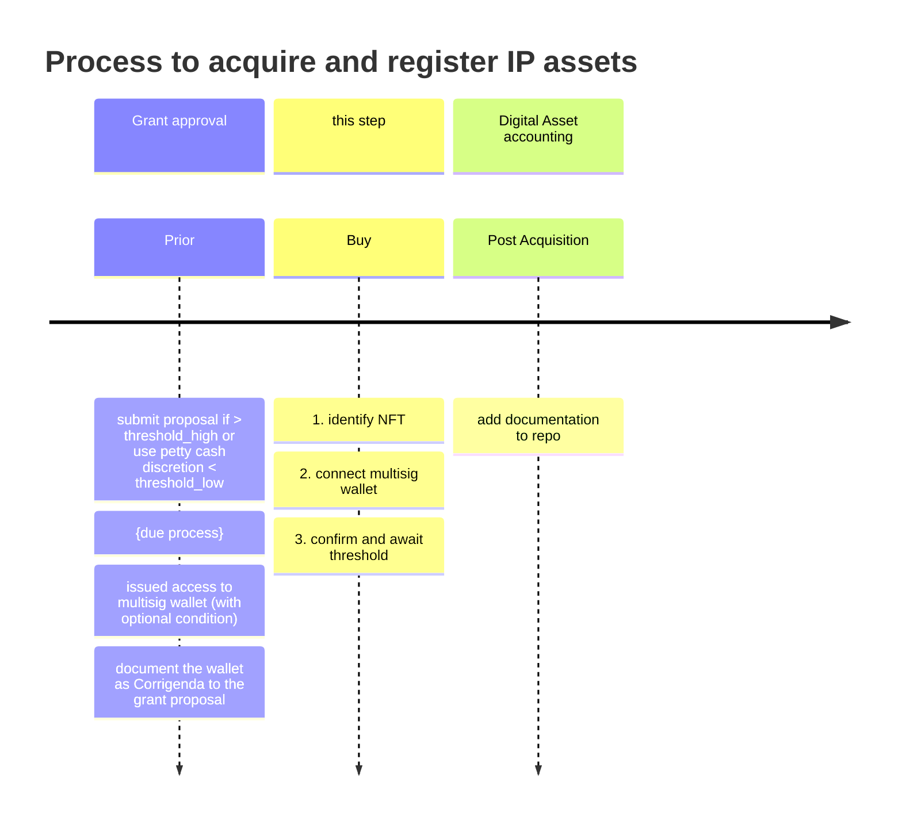

# Acquiring IP Using multisig SAFE

## Buying NFT from OpenSea
### Step 1 - Get the wallet connect link
[ ] Go to OpenSea to the NFT you wish to purchase and enter the page for the NFT.  
[ ] Click "login" at the top right corner.  
[ ] Select Wallet Connect from list.  When you do, a window with a QR code will appear.  
[ ] In the top right corner of that window will be a "copy" icon.  Click it to add to your clipboard.

### Step 2 - Go to your SAFE account and log in
[ ] Log into your SAFE and 
[ ] click the dApp icon in the top menu bar.  It looks like a 'w'.  When you click this icon, 
[ ] a window will appear that shows an input field with the text 'wc' in the field.  
[ ] Paste the link from OpenSea into this bar and hit the "Paste" button. This should now show a connection to the NFT you were looking at.

### Step 3 - Confirm the purchase
[ ] From within the SAFE Application main browser window a message will appear that asks for confirmation of your multisig connection to OpenSea.  
[ ] Sign it.  
[ ] If you require multiple signatures it is **IMPORTANT** that this window will need to remain open until the threshold is met.  

### Step 4 - Catch typical errors

I'm not actually buying an NFT in this case so I cannot continue further down the purchase path, but I imagine it will be pretty straight forward from here.  If you need additional help, the flow from this point forward should look like this artice from [Safe's Knowledge Base](https://help.safe.global/en/articles/108235-how-to-connect-a-safe-to-a-dapp-using-walletconnect)

### Step 5 - Exception atypical errors

[ ] Is there anomalous activity which may be a phishing attack?
