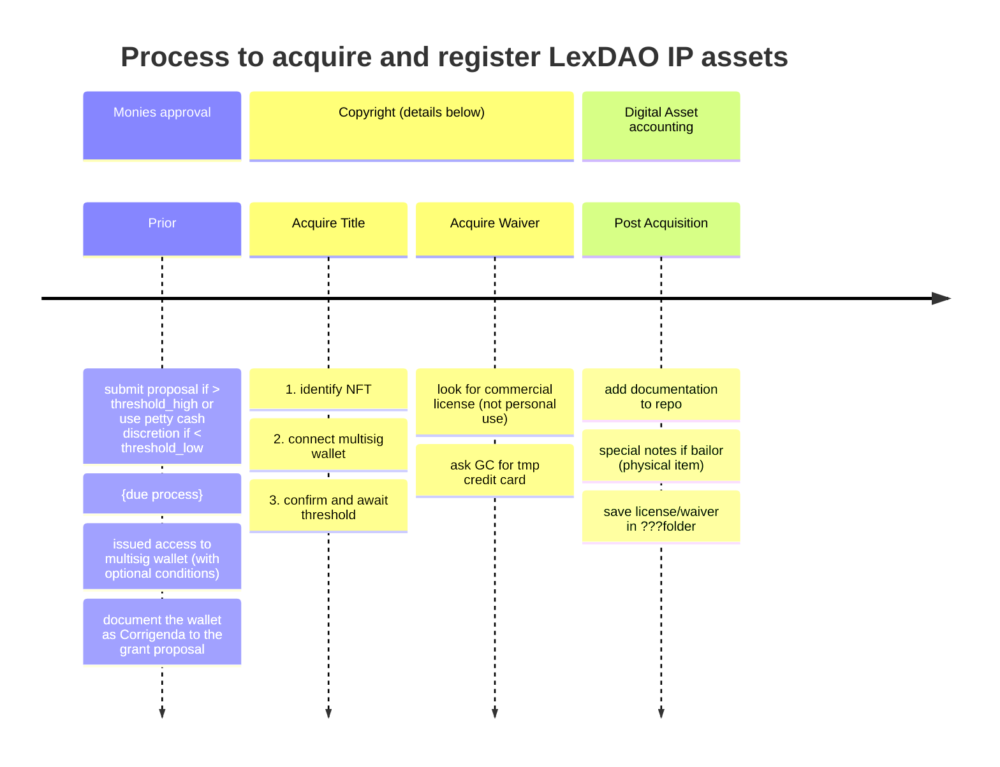

# Acquiring IP Using multisig SAFE

----
> [!WARNING]
> Because LexDAO is an organisation, you cannot use personal licenses/waivers for 3rd party imagery or graphics im articles
> Because audits are random, your sponsor must instruct you on the necessary procedures (it'd look silly for legal engineer to not engineer their own legals)

Use cases
1. Buying base NFT from OpenSea
2. Buying non-personnal-use graphics /tba/
3. ... ?

## Buying NFT from OpenSea
### Step 1 - Get the wallet connect link
[x] Go to OpenSea to the NFT you wish to purchase and enter the page for the NFT.  
[x] Click "login" at the top right corner.  
[ ] Select Wallet Connect from list.  When you do, a window with a QR code will appear.  
[ ] In the top right corner of that window will be a "copy" icon.  Click it to add to your clipboard.

### Step 2 - Go to your SAFE account and log in
[x] Log into your SAFE (using addr given to you by GC or committee hat wearer)  
[x] click the dApp icon in the top menu bar.  It looks like a 'w'.  When you click this icon, 
[ ] a window will appear that shows an input field with the text 'wc' in the field.  
[ ] Paste the link from OpenSea into this bar and hit the "Paste" button. This should now show a connection to the NFT you were looking at.

### Step 3 - Confirm the purchase
[ ] From within the SAFE Application main browser window a message will appear that asks for confirmation of your multisig connection to OpenSea.  
[ ] Sign it.  
[ ] If you require multiple signatures it is **IMPORTANT** that this window will need to remain open until the threshold is met.  
[ ] check the NFT finalisation via etherscan

### Step 4 - Catch typical errors

> [!TIP]
> I'm not actually buying an NFT in this case so I cannot continue further down the purchase path, but I imagine it will be pretty straight forward from here.  If you need additional help, the flow from this point forward should look like this artice from [Safe's Knowledge Base](https://help.safe.global/en/articles/108235-how-to-connect-a-safe-to-a-dapp-using-walletconnect)

connection rejected
WTF?!?

connection request reset
WTF?!?

unsupported chain
OpenSea supports (as of 2q2024) 8 chains

Wrong unit
wETH as recipient token

### Step 5 - Debugging atypical errors

> [!WaRNING]
> Is there anomalous activity which may be a phishing attack?

)
Look at the actual wallet connect [protocol](https://platonnetwork.github.io/docs/en/walletconnect_tutorial/) URI

`wc:84d75e28f2f6b0516ccfcf0979e99ff88d8aa24163d1f6a18333385e43311221@2?relay-protocol=irn&symKey=374557a4d0e58edbc27259202368f403c0994a15f65215ed4672ca77e46e67eb`

Missing cookies ... sometimes the site might be expecting secret session info which is not in your current window.
