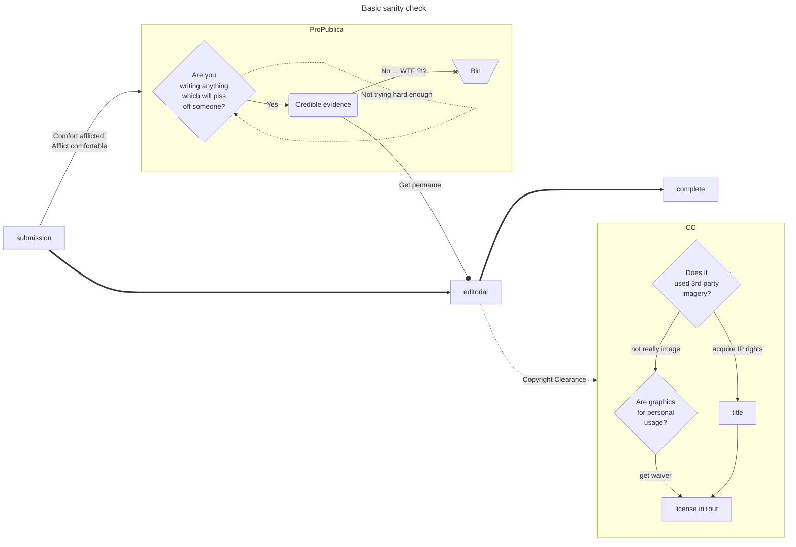

# Decision Tree to specific traps & pitfalls

```mermaid
---
title: Basic sanity check
---
flowchart LR
  submission
  submission==>editorial
  submission-->|"Comfort afflicted,
Afflict comfortable"|ProPublica
  subgraph ProPublica
    direction RL
  libel{"Are you
writing anything
which will piss
off someone?"}
  libel-.->|Not trying hard enough| libel
  libel-->|Yes|truth
  truth("Credible evidence")
reject[\Bin/]
truth--x|No ... WTF ?!?| reject
  end
truth--o|Get penname| editorial
  editorial
  subgraph CC
    direction TB
    imagery{"Does it
used 3rd party
imagery?"}
    imagery-->|acquire IP rights| title
    title
    imagery-->|not really image|graphics
    graphics{"Are graphics
for personal
usage?"}
    graphics-->|get waiver|license
    license["license in+out"]
    title --> license
  end
  editorial-.->|Copyright Clearance|CC
  editorial==>complete
  complete
```
