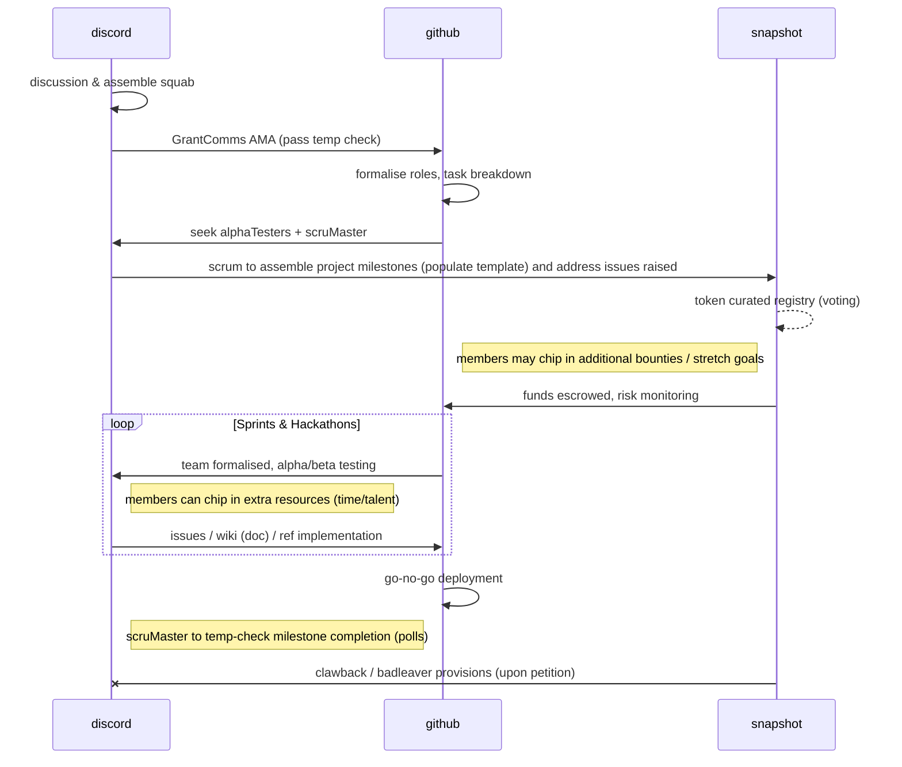

# LexDAO Updates

## ETH Denver
LexDAO's presence at ETH Denver was a massive success by all accounts.  Members from across the globe had the chance to get together, enjoy each other's company, and discuss ideas for the future.  We also had the opportunity to interact with a number of key partners across the space and continue to build relationships that should help LexDAO ride the bear market wave that is currently at hand.  

As part of our time in Denver, both Kyle (@bestape) and Nick (@trtius) participated in an event sponsored by MetaCartel and Unlock Protocol to discuss some of the nuances of the regulatory environment globally around the world.  Much of the discussion was around network states in Prospera, a unique economic zone in Honduras and the freedom that developers are seeking out in global markets that are more friendly to the crypto space.  It was good to hear from both panelists to discuss the positive and negative aspects of these "free for all" communities, especially with regard to the preservation of integrity in these spaces.

There is a signficant dialogue around the idea of helping local communities as a result of a new digital revolution.  To hear more, feel free to listen to the dialogue [here :sound:](https://app.frame.io/presentations/b344a7ef-07a9-468c-a7e7-a898e3427f4c).

## Optimism Grant Funding

The Optimism Grant round was successful and we have seen an opening pipeline of Optimism tokens flowing into the LexDAO treasury.  In the most recent tally the USD value of the total token drop will be something like $250K plus or minus depending on the Optimism token value on any given day. Over the last few weeks the Operating Committee has taken a look at a budget proposal that helps to increase compensation for our DAO wide Directors as well as to jump start some of the strategic positions that will help bring future value to the organization.  Some of those proposals include a potential General Counsel role which will help with risk mitigation and contracting in the future of the DAO as well as providing compensation to all of our Operating Committee members moving forward.  

As part of this token drop, the Operating Committee has also suggested that we begin considering a treasury allocation of tokens that allows LexDAO to begin creating validator nodes on key networks.  This includes Etherium, Polygon, Gnosis, Optimism, and others as part of our overall support of maintaining liquidity pools and participating in the networks of blockchains that we believe in, as well as provide risk-free yield on the passive aka lazy treasury holdings.  We hope to provide a breakdown proposal for this initiative as a supplemental proposal.

Be on the lookout for the final draft of the budget which will be up for Snapshot vote in the coming weeks.  

## Simplifing Proposals
As an ancillary task, @drllau has a [template](https://github.com/lexDAO/DAO-Proposals/blob/drllau-patch-1/template.md) for grant proposals. The key result will be sufficient outline for the squabble of legal engineersr to give the context (for snapshot voting) whilst linking to discussion points and project milestones within github [repo](https://docs.github.com/en/issues/planning-and-tracking-with-projects/learning-about-projects/about-projects) (history of deliberation). 

The objective is to have sufficient info to fit within 3-5 year horizon roadmap yet **defer detailed workup** until a temperature check to gather sufficient momentum for formal allocation of (matching) resources and delegation for monitoring milestones.

## Membership Drive
LexDAO is tracking to garner 250 paid memberships by the end of 2024.  This is a big goal but we are working our way toward it step by step.  As we continue to embark on the philosophy of _Law as a Public Good_, we hope that those around the community will continue to support the organization and its future development.  Part of this initiative will be centered around our ongoing presence at in-person events throughout the year where we will aim to put on events and commentary including exclusive content and networking opportunities.  Please continued to support these initiatives and consider joining at lexdao.org/membership.

As part of delivering more value to our paid members, we are experimenting with
1. more topical and focused study-groups (4th April session on [Wyoming DUNA](https://discord.com/events/682960432272506907/1221887409764040825);
2. pathway to LEETH certification including (l)extern [legal clinic](https://discuss.octant.app/t/lexdao-law-is-a-public-good/271) and priority placement for legal-engineering work;
3. DAO governance case-studies published in journals with citation counts.
 
## Network Infrastructure
One of the projects which has remained on hold for some time now and is being actively restarted is the deployment of a network infrastructure.  We have partnered with [Hats protocol](https://www.youtube.com/watch?v=f0830UGgjWU) to help build on top of the existing ERC-721 membership token deployed earlier this year through Unlock Protocol.  Hats Protocol allows us to create a nested permission tree which will allow for permissions to various parts of the LexDAO network.  It will also help us to govern treasuries appropriately and to allow committees the autonomy to act on the DAO's behalf in their individual spheres of influence.  

We are currently concepting a first draft of this network setup which will hopefully be ready for alpha testing before the end of April.  There will be working groups set up to manage the deployment of this network and to debate the structure in the coming weeks which we encourage members to participate in.  This will help reshape the DAO and will be a significant step to our local implementation of the concept of Code is Law.

## Study Group
Paolo Gangi has been hard at work setting up our next riviting Study Group discussion on DUNA (Decentralized Unincorporated Non-profit Association) organizational models with some incredible speakers.  A controversial topic, we've been able to secure representation from David Kerr and Michael Jennings of A16Z as well as a long time LexDAO LEETH holder Jordan Teague along with JupiterBlock.  We expect this to be an intellectually stimulating and informed conversation around the benefits and risks associated with this type of U.S. Legal structure both nationally and abroad.  If you would like a little pre-read materials, please check out [this article](https://a16zcrypto.com/posts/article/duna-for-daos/) by David and Michael.  Please join us on April 4th at 10AM PST.  The link will be posted in our Discord.

## Member Activity/Posts
Legal engineering builds bridges between wet-ink and firm code contracts, and as practitioners, we need to practice what we preach. 
- @ross has published a [lite paper](https://lexcuria.eth.limo/) on ADR [^1]; 
- @drllau - [article](https://paragraph.xyz/@developersguild/preview/7dYXMPaWaXRdq46OmvEL) on Creative Commons rights expression language;
- @g5mpartner - [article]() on psychographic indicators;
- @shaswata - linkedin [post](https://www.linkedin.com/posts/shaswatakapat_cryptoassets-judgment-sec-activity-7175734893031636992-OCmi) comparing expansive regulatory action vs a narrow court defeat on classication of financial product.

[^1]: Ross Campbell (Mar 2024), _CURIA: Curated online legal services_
> Curia is a proposed onchain protocol for selecting qualified custodians and dispute resolution services to help secure tokenized assets. It anticipates and provides
an account-abstraction convenience to install supervision over transactions more
directly than other alternatives. In this manner, Curia does not seek to interrupt
the base layer or promote a private approach to legal finality on the blockchain.
Curia instead represents an opt-in and free market system for more legal inputs to
primarily code-based systems.

