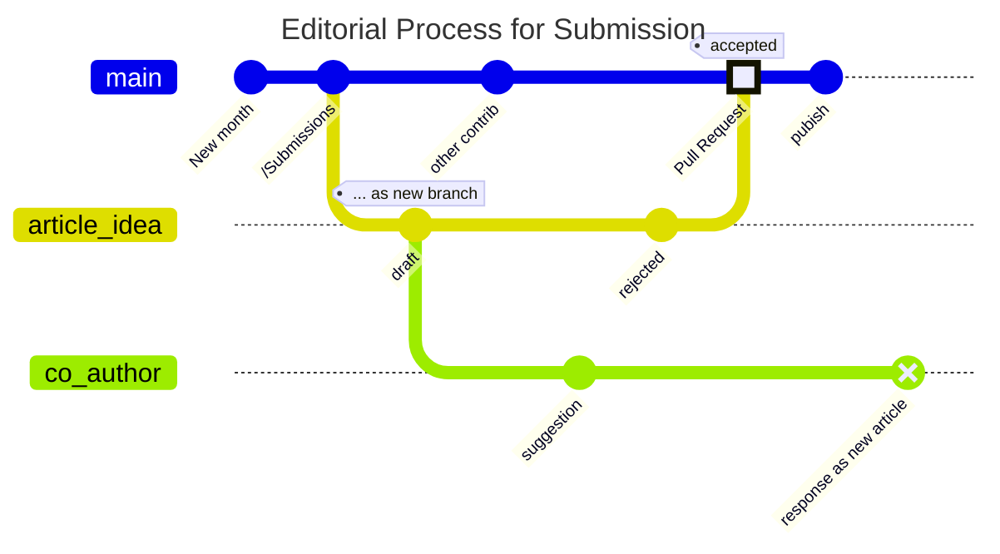

# LexDAO-Articles
Currently all articles are published live on our Substack integration for LexDAO through LexNews+, a part of the communications committee for the DAO.
 - [LexNews+ Substack](https://lexdao.substack.com/)

In preparation for publication, as a repository of ideas and content, and as a potential place where members can eventually collaborate on publications, we've set this [folder](https://github.com/lexDAO/LexDAO-Articles/tree/drllau-gitGraph/Newsletter/Monthly/Submitted) up to house different content for articles, OpEd or reviews.  

## Process
When submitting articles for review, please go into the appropriate folder for the project you are submitting to, and place your file inside the **Submitted** directory.  

It is **important** that you create a branch that clearly indicates who you are when doing this and that you initiate a pull request.  If you intend for multiple co-authors, then sync from github to hackMD as collaborative editor with word level commentary. When you commit your files, we ask that you also please "sign" your commits (helps in tracking authorship).  

Articles that are approved will be moved by the editors into the appropriate approved folders.

### Naming Convention
When submitting your articles, you should include the following naming convention:
 - "[Year]-[Month]_LexDAO_[Name of the Periodical]_[Title or Short title of your Article]_[YourName/Pseudonym].md"
    - For example: A monthly article submission in Jan 2024 by cimply should look like this: 2024-01_LexDAO_Monthly_Cimply.md

 ### Format
 All articles should be properly formatted using markdown and must utilize heading structures where appropriate. [Citations](https://guides.library.ubc.ca/legalcitation/intlaw) using the [^1] shortcut should preferentially reference primary/secondary sources in the /tba @Fortunado/ style

[^1]: Footnotes at bottom of article in _style_ /tba/
